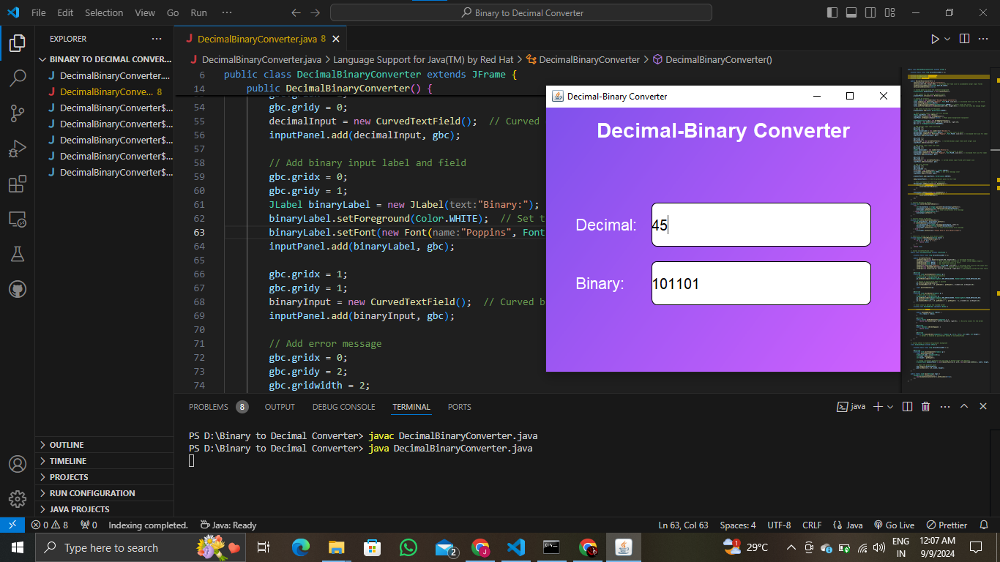

# Decimal-Binary Converter

## Project Overview
The Decimal-Binary Converter is a Java Swing-based GUI application that allows users to convert between decimal and binary number systems in real-time. The interface features custom curved input fields for the decimal and binary inputs, along with a gradient background for a modern and sleek appearance.

## Features
- **Decimal to Binary Conversion**: Enter a decimal number, and the binary equivalent will automatically be displayed.
- **Binary to Decimal Conversion**: Enter a valid binary number, and the decimal equivalent will be displayed.
- **Real-Time Conversion**: Changes in the input fields immediately update the converted value.
- **Error Handling**: Displays an error message if an invalid binary number is entered.
- **Custom UI Elements**:
  - Curved Input Fields: Rounded corner text fields for a more polished appearance.
  - Gradient Background: Custom gradient background to enhance visual appeal.

## Screenshots


## How to Run the Program
1. Ensure you have JDK installed (version 8 or higher).
2. Compile and run the `DecimalBinaryConverter.java` file:
   ```bash
   javac DecimalBinaryConverter.java
   java DecimalBinaryConverter

## Contributing
Feel free to fork this repository, create a feature branch, and submit a pull request. All contributions are welcome!

   
